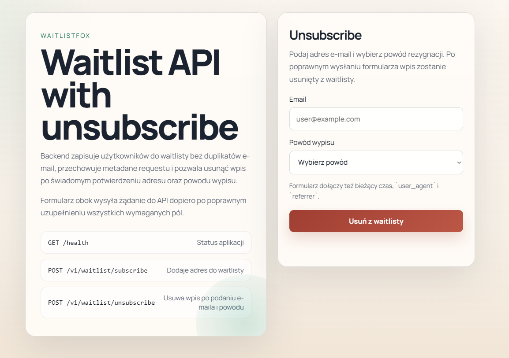

# waitlistFox

`waitlistFox` is a simple backend API for waitlist signup built on top of Echo and GORM, with switchable MySQL or PostgreSQL support.

## Structure

```text
config/
controllers/
internal/
models/
services/
static/
store/
main.go
```

## What's included

- public `POST /v1/waitlist/subscribe` endpoint
- MySQL or PostgreSQL persistence for `waitlist_subscribers`
- duplicate email protection through a unique constraint
- consent fields, campaign ID, request metadata, and notification timestamp
- optional reCAPTCHA verification configured in `config/config.json`
- `internal/config.go` with configuration loading and MySQL connection setup
- `internal/logger.go` with a JSON logger writing to both file and stdout
- `internal/validator.go`
- `internal/middleware/language.go`
- `internal/i18n/` with a simple translation loader
- `static/index.html`

## Running

```bash
cd waitlistfox
go run . -migrate=true
```

By default, the application reads configuration from `config/config.json`.

## Docker

The repository includes a Docker image and an API-only `compose.yaml`. It does not start MySQL. The database should be provided separately.

1. Create your server-side config as `config/config.json`.
2. Build and start the API:

```bash
docker compose up -d --build
```

3. Run migrations when needed:

```bash
docker compose run --rm api ./waitlistfox -config /app/config/config.json -migrate=true
```

Useful runtime details:

- the API listens on container port `8081`
- host port is controlled by `WAITLISTFOX_PORT`
- config is mounted from `./config` to `/app/config`
- in Docker, logs go to `docker logs` by default because `LOG_TO_FILE=false`
- if you want file logs too, set `LOG_TO_FILE=true` and ensure `./log` is writable for the container user
- you can also enable startup migrations by setting `MIGRATE_ON_START=true`
- if your database runs outside this Compose stack but is exposed on the host, use `host.docker.internal` instead of `127.0.0.1` in `config/config.json`

## Production Docker

For a server deployment without GHCR, use `compose.prod.yaml` and `deploy.sh`.

Files:

- `compose.prod.yaml`: production-oriented Docker Compose file for the API only
- `.env.production.example`: example runtime values for port, bind IP, timezone, and container name
- `deploy.sh`: simple deployment helper for build, migrate, start, logs, and status

Suggested server setup:

1. Clone the repo on the server.
2. Create the real app config:

```bash
cp config/config.example.json config/config.json
```

3. Create production env values:

```bash
cp .env.production.example .env.production
```

4. Edit both files:
- `config/config.json`: DB host, user, password, db name, reCAPTCHA
- `.env.production`: host bind IP and public port

5. Make the deploy script executable:

```bash
chmod +x deploy.sh
```

6. First deployment:

```bash
./deploy.sh
```

7. Next deployments:

```bash
./deploy.sh
```

Useful commands:

```bash
./deploy.sh status
./deploy.sh logs
./deploy.sh migrate
./deploy.sh deploy --skip-git-pull
./deploy.sh deploy --skip-migrate
```

What the deploy script does in `deploy` mode:

1. `git pull --ff-only`
2. `docker compose -f compose.prod.yaml build api`
3. optional migration run in a one-off container
4. `docker compose -f compose.prod.yaml up -d --remove-orphans api`

Recommended production pattern:

- keep the API bound to `127.0.0.1`
- expose it publicly through Nginx or Caddy as a reverse proxy
- keep `config/config.json` only on the server and out of git

## Endpoints

- `GET /health`
- `POST /v1/waitlist/subscribe`
- `POST /v1/waitlist/unsubscribe`

Example payload:

```json
{
  "userType": "passenger",
  "email": "john@example.com",
  "phone": "+48123456789",
  "consents": {
    "waitlist": true,
    "marketing": false,
    "cookies_analytics": true,
    "cookies_marketing": false
  },
  "recaptcha_token": "client-token",
  "timestamp": "2026-03-30T12:34:56.789Z",
  "user_agent": "Mozilla/5.0...",
  "referrer": "https://google.com",
  "campaignId": "homepage-hero"
}
```

`campaignId` is optional. When reCAPTCHA is enabled in config, the backend verifies the token against the configured `minimum_score`. Scores below the threshold are rejected.

Unsubscribe payload:

```json
{
  "email": "john@example.com",
  "reason": "not_interested",
  "timestamp": "2026-03-31T09:18:00.000Z",
  "user_agent": "Mozilla/5.0...",
  "referrer": "https://waitlist.example.com/account"
}
```

## Configuration

The `recaptcha` section supports:

- `enabled`
- `secret_key`
- `verify_url`
- `expected_action`
- `minimum_score`
- `timeout_seconds`

Default score guidance implemented by config:

- `0.9 - 1.0`: accept
- `0.7 - 0.8`: accept
- `0.5 - 0.6`: accept, but monitor
- `0.3 - 0.4`: reject or require additional verification
- `0.0 - 0.2`: reject

Database configuration supports:

- `database.type`: `mysql` or `postgres`
- `database.host`
- `database.user`
- `database.password`
- `database.dbname`
- `database.port`
- `database.sslmode`: used for PostgreSQL, default `disable`
- `database.dsn`: optional explicit DSN override for either engine

## HTML Preview


